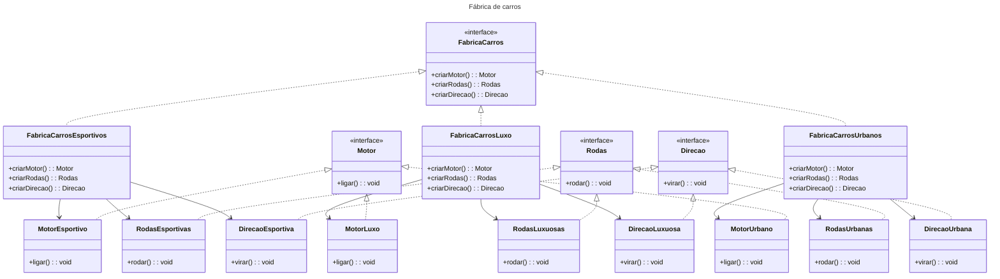

## Motivação
Imagine que você está desenvolvendo um sistema para uma fábrica de carros que produz diferentes tipos de veículos, como esportivos, de luxo e urbanos. Cada tipo de carro tem componentes específicos, como motores, rodas e sistemas de direção. Criar esses componentes manualmente para cada tipo de carro pode ser complexo, e o padrão Abstract Factory pode ser usado para garantir que os componentes de cada tipo de carro sejam consistentes.

## Estrutura

    
## Participantes
- Motor, Rodas, Direção (Abstract Product): Interfaces que definem os métodos comuns para todos os tipos de componentes de carro.
- FabricaCarros (Abstract Factory): Interface que declara os métodos para criar as famílias de componentes (motor, rodas e direção).
- FabricaCarrosEsportivos, FabricaCarrosLuxo, FabricaCarrosUrbanos (Concrete Factory): Implementam a interface da fábrica e criam os componentes específicos para cada tipo de carro.
- MotorEsportivo, RodasEsportivas, DirecaoEsportiva, MotorLuxo, RodasLuxuosas, DirecaoLuxuosa, MotorUrbano, RodasUrbanas, DirecaoUrbana (Concrete Product): As implementações concretas dos componentes, cada uma correspondente a um tipo de carro.

### Explicação
A FabricaCarros é uma interface abstrata que define os métodos para criar as partes de um carro: o motor, as rodas e a direção.
As fábricas concretas (FabricaCarrosEsportivos, FabricaCarrosLuxo, FabricaCarrosUrbanos) implementam a interface da fábrica abstrata, criando componentes específicos para cada tipo de carro.
As classes concretas de componentes (MotorEsportivo, RodasEsportivas, etc.) implementam as interfaces de componentes comuns, garantindo que cada tipo de carro tenha a combinação certa de partes.